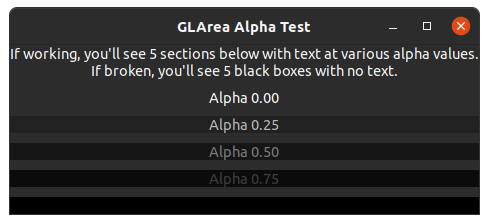
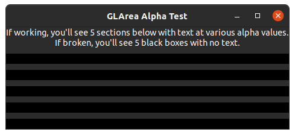

# GLArea Transparency Test

### Build/Install the flatpak with:

```sh
$ ./flatpak-install
```

### Run the flatpak with:
```sh
$ flatpak run org.marler.gl-alpha-test
```

Revert back to the latest working version (released 2024-01-06):
```
sudo flatpak update --commit=e6f142e232584a0575c084d3d619fc5a81b73f39b84d939672f2fd91fb284f63 org.gnome.Platform/x86_64/45
```

Update the earliest non-working version (released 2024-01-15):
```
sudo flatpak update --commit=433c3873b13cee348d2724c0c32a14e149aebf38dffd9710fe3f514a784feae7 org.gnome.Platform/x86_64/45
```

> NOTE: the "latest working" and "earliest broken" versions for 44 are:

```sh
# latest working (2023-12-15)
$ sudo flatpak update --commit=8633b80ad57b272e38c51a53704f1c096fd1a1bd3da5005241f9beb1d123fd71 org.gnome.Platform/x86_64/44

# earliest broken (2024-01-09)
$ sudo flatpak update --commit=af9771528c16267ff974784890b39714541fa093adaea0a2bf26bfdbc586d4fd org.gnome.Platform/x86_64/44
```

## Working



## Broken


